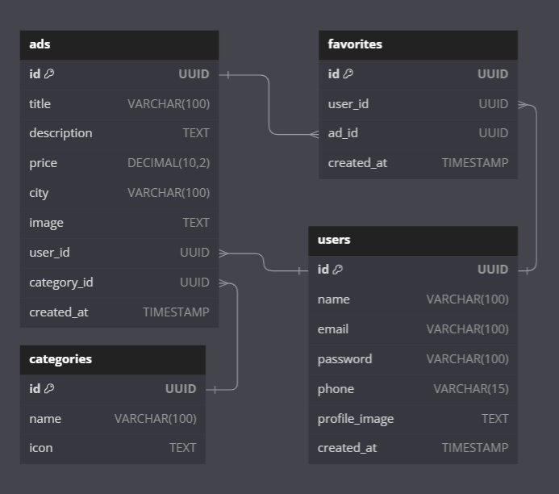

# Aplicação de anúncios - Programação de Aplicação para Servidor

## Introdução

Este projeto é composto por dois componentes principais:

1. **Aplicação Android**: Uma aplicação móvel desenvolvida em Java no Android Studio. Ela utiliza uma API para acessar, gerir e armazenar dados.
2. **Website**: Um site desenvolvido no Laravel que serve tanto como uma interface para o utilizador quanto como documentação para a API.

Ambos os componentes usam a mesma API backend, que também foi desenvolvida com a framework Laravel.

---

## Funcionalidades

  - Gestão de utilizadores: Registo, login e logout.
  - Criação de anúncios: Os utilizadores podem criar anúncios com título, descrição, preço e categoria.
  - Navegação por categorias: Visualizar anúncios agrupados por categorias.
  - Excluir anúncios: Gerir e excluir anúncios diretamente na aplicação.


---

## Tecnologias Utilizadas

- **Java**: Desenvolvimento da aplicação Android.
- **Laravel**: Desenvolvimento do backend e do site.
- **Retrofit**: Integração do aplicação Android com a API.
- **Material Design**: Para criar uma interface moderna e responsiva na Aplicação Android.
- **Bootstrap**: Para criar uma interface moderna e responsiva no Website.

---

## Estrutura da Base de Dados

### Banco Externo
Os dados dos utilizadores, anúncios, favoritos e categorias são armazenados em uma base de dados externa gerida pela API Laravel.
<div align="center">
 
</div>

---

## Documentação da API

### Obter Todas as Categorias

```
GET /api/categories
```
| Tipo       | Descrição                           |
|------------|-------------------------------------------|
| `Array`    | Retorna todas as categorias registadas    |

### Obter Anúncios por Categoria

```
GET /api/categories/{id}/ads
```
| Tipo       | Descrição                                   |
|------------|-------------------------------------------|
| `Array`    | **Obrigatório:** O ID da categoria         |

### Criar Anúncio

```
POST /api/ads
```
| Tipo       | Descrição                                   |
|------------|-------------------------------------------|
| `Object`   | **Obrigatório:** Dados do anúncio            |

### Excluir Anúncio

```
DELETE /api/ads/{id}
```
| Tipo       | Descrição                                   |
|------------|-------------------------------------------|
| `Object`   | **Obrigatório:** O ID do anúncio            |

---


## Autores

- Afonso Pamplona | Nº 25911
- Nuno Faria | Nº 25906

